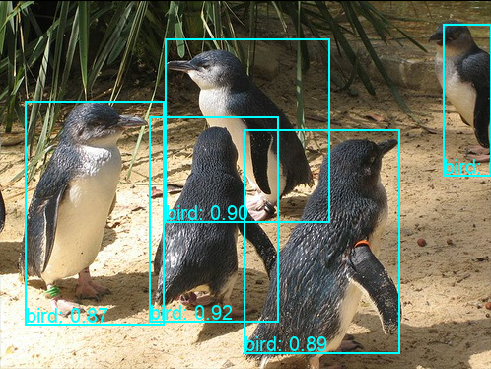
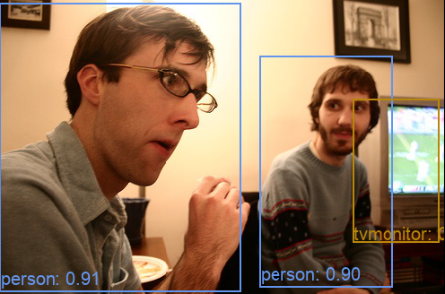

## Yolov2 Pytorch Implementation

This repository aims to learn and understand the YOLO algorithm. I am a beginner of deep learning, and I found the best way to learn a deep learning algorithm is to implement it from scratch. So if you also feel this way, just follow this repo! The code in this projects is clear and easier to understand, and I also documented it as much as possible. 

<div style="color:#0000FF" align="center">

 
</div>

## Purpose

- [x] train pascal voc
- [x] multi-GPUs support
- [x] test
- [x] pascal voc validation
- [x] data augmentation
- [x] pretrained network
- [ ] reorg layer
- [ ] multi-scale training
- [ ] reproduce original paper's mAP

## Stages and Results

Since this algothrim is implmented from scratch, there are many stages and results which is very helpful for us to understand each component and how to improve it.

The reported results is as follows:

|id| train data | aug | pretrained|  mAP (on train) | mAP (on test)|
| --- | ---------- | ---------- | --- | ---------- | --- |
| 1 | 07 train | | |84.7| 10.7|
| 2 | 07 trainval | | | 8x.x |17.x| 
| 3 | 07 trainval|:white_check_mark: | | 73.2 | 34.6 |
| 4 | 07 trainval| :white_check_mark:| :white_check_mark:| 86.9 | 58.4 |
| 5 | 07+12 trainval| :white_check_mark:| :white_check_mark:| 86.5 | 65.2 |

#### Results analysis

**stage1**
Obviously, this model is in the over-fitting situation. In another word, it is a low bias and high variance model. I guess the reason is that the number of data is too small, and I don't apply data augmentation and transfer learning. However, it proves our model is correct at least, right?

**stage2** I use more data including train set and validation set. The performance is better, though it's still over-fitting.

**stage3** With data augmentation technique, the mAP become much better than that of *stage 2*. However, We can notice that the performance on training set is worse, which means we encounter a optimization problem.

**stage 4** I convert the weights data downloaded from [offical website](https://pjreddie.com/darknet/imagenet/), and change the input data value to 0 ~ 1. It turns out that the model can fit the data very well and have extremly help on over-fitting.

**stage 5** Nothing new, just use more train data. I combine the data from voc 2007 trainval and voc 2012 trainval.


I will keep on updating this repo in the next few months.

## Prerequisites
- python 3.5.x
- pytorch 0.4.1
- tensorboardX
- opencv3

## Preparation

First clone the code

    git clone https://github.com/tztztztztz/yolov2.pytorch.git

Then create some folder

    mkdir output 
    mkdir data

## Demo

Download the pretrained weights [Dropbox](https://www.dropbox.com/s/ktri39krexxpa5d/yolov2_epoch_160.pth?dl=0)

Place the weights file in the `$ROOT/output` folder

You can run the demo with `cpu` mode

    python demo.py

Or with `gpu` mode

    python demo.py --cuda true

## Training on PASCAL VOC

### Prepare the data

1. Download the training data.

    ```bash
    wget http://host.robots.ox.ac.uk/pascal/VOC/voc2007/VOCtrainval_06-Nov-2007.tar
    wget http://host.robots.ox.ac.uk/pascal/VOC/voc2007/VOCtest_06-Nov-2007.tar
    wget http://host.robots.ox.ac.uk/pascal/VOC/voc2007/VOCdevkit_08-Jun-2007.tar
    
    # download 2012 data
    wget http://host.robots.ox.ac.uk/pascal/VOC/voc2012/VOCtrainval_11-May-2012.tar
    ```    


2. Extract the training data, all the data will be in one directory named `VOCdevit`. We use `$VOCdevit` to represent
the data root path

    ```bash
    tar xvf VOCtrainval_06-Nov-2007.tar
    tar xvf VOCtest_06-Nov-2007.tar
    tar xvf VOCdevkit_08-Jun-2007.tar
    
    # 2012 data
    tar xvf VOCtrainval_11-May-2012.tar
    ```

3. It should have this basic structure

    ```
    $VOCdevkit/                           # development kit
    $VOCdevkit/VOCcode/                   # VOC utility code
    $VOCdevkit/VOC2007                    # image sets, annotations, etc.
    ```

4. Create symlinks for the PASCAL VOC dataset

    ```
    cd yolov2.pytorch
    mkdir data
    cd data
    mkdir VOCdevkit2007
    cd VOCdevkit2007
    ln -s $VOCdevit/VOC2007 VOC2007
    
    # mkdir VOCdevkit2012
    # cd VOCdevkit2012
    # ln -s $VOCdevit/VOC2012 VOC2012
    ```
    
### Download pretrained network

    cd yolov2.pytorch
    cd data
    mkdir pretrained
    cd pretrained
    wget https://pjreddie.com/media/files/darknet19_448.weights
    


### Train the model
    python train.py --cuda true
     
 if you want use multiple GPUs to accelerate the training. you can use the command below.
 
    python train.py --cuda true --mGPUs true
    
    
## Testing 
 
    python test.py --cuda true
 
 


